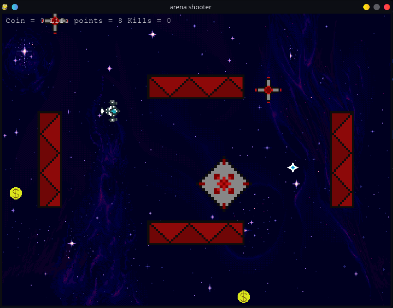

# Galaxy Traveller
This is a small game I built with the pygame library for a science festival at my school (Hội vui Khoa học Tự nhiên Chuyên Ngoại Ngữ 2021)
In this game, you control a spaceship. Your objective is to collect as many coins and kill as many enemy spaceships as possible. _The score is measured  by `coins + kills*2`_. 
The player will have 10 hp but it can be increased by 1 for each 5 coins earned  
There are two types of enemies:
+ Type 1 - Shooter :the smaller one, capable of shooting in 4 directions (like a plus sign) if you are within its shooting range
- Attr: dmg - 1 hp/bullet ; health - 1hp
+ Type 2 - Chaser: the bigger one, capable of passing through walls, causing an explosion upon close contact
- Attr: dmg - 2hp ; health - 2hp
There are also boosts to help you destroy your enemies easier:
+ Ricochet bullets (but won't bounce if they encounter a wall)
+ Multishot (3 bullets at once)
+ Super speed (x2 current speed)
The boost item is spawned randomly and you can't tell which ability will be granted by the appearance of the item.
I have finished this game a long time ago, but I am recently updating it to improve & fix small bugs.
There is a `settings.json` file for you to change some attributes of the game.
+ Wall:  the 4 numbers are x_len, y_len, x_pos, y_pos respectively
+ The shoot range of Shooter, which is currently 1px

In this patch (1.0.2) I mainly reformat the code.

Anyways here is an screenshot of the game:

## Running the project
Dependencies: `pygame` (`cx_freeze` if you want to build the game)

Run `menu.py` to start the game
